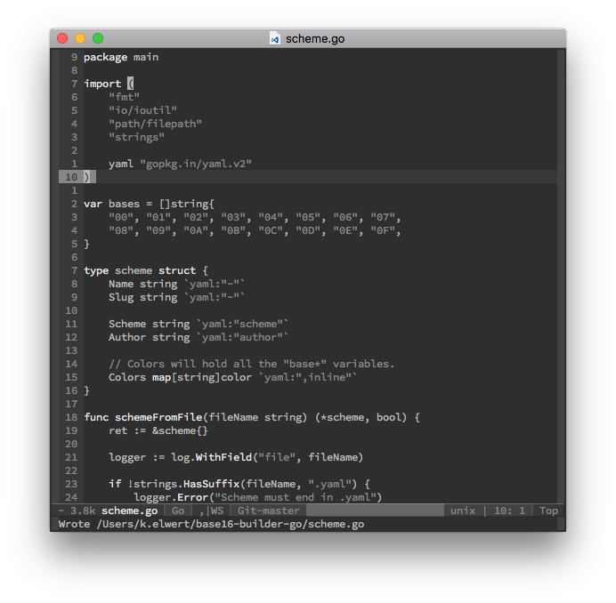
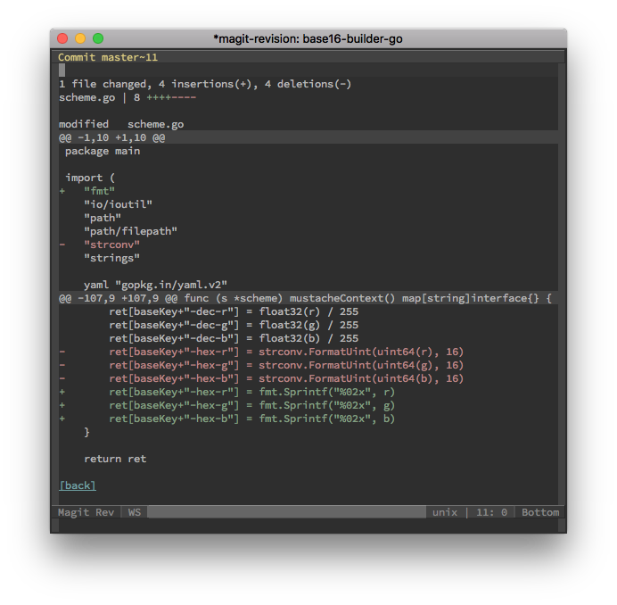

# emacs-grayscale-theme

This is a simple, mostly grayscale theme, created as a mashup of some ideas of
the Duotone Atom themes, the base16 emacs themes, and zenburn.

It is currently meant as an experiment and may not be supported in the future,
so use at your own risk.

## Colors

There are a few sets of colors you need to be aware of. The first is the
background sets. They are arranged below darkest to lightest.

TODO: Guidelines for using the `bg` colors.

*  `#2e2e2e bg`
*  `#383838 bg+1`
*  `#424242 bg+2`
*  `#474747 bg3`

The foreground colors are also arranged from darkest to lighest. They should be
used for most text. `fg` is meant to be used for general text, while `fg-1`
should be used to deemphasize text (like comments and strings) and `fg+1` should
be used to emphasize text (like variable names).

*  `#868686 fg-1`
*  `#b6b6b6 fg`
*  `#e6e6e6 fg+1`

The next set of colors are used only as accent colors and should be used
sparingly.

TODO: Find a better base `blue` and maybe switch the current blue to
one of the cyan accents.

*  `#8c5353 red-1`
*  `#bc8383 red`
*  `#dca3a3 red+1`
*  `#dfaf8f orange`
*  `#d0bf8f yellow`
*  `#f0dfaf yellow+1`
*  `#7f9f7f green`
*  `#8fb28f green+1`
*  `#6ca0a3 blue`
*  `#94bff3 blue+1`
*  `#8cd0d3 cyan`
*  `#93e0e3 cyan+1`
*  `#dc8cc3 magenta`
*  `#ec93d3 magenta+1`

## Screenshots

General usage. This one doesn't have any of the accent colors in use.

The most common accent colors, green and red, being shown in a diff.

